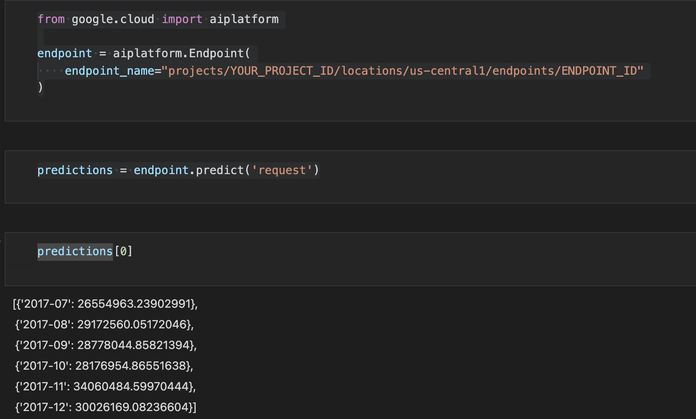

# Get-Predictions-Using-Custom-Trained-Model

### Intro
This is a project to create an endpoint that you can request and get predictions from using your custom-trained model. The endpoint was created in Google Cloud. In this project, time series sales data was extracted from Kaggle　[ドキュメント情報共有サービス NotePM](https://notepm.jp) and uploaded to Google Cloud Storage. The model that would be trained here is a model to forecast sales values in the future. The creating endpoint steps details are shown below.

---

### GCP Services used in this project
- Cloud Storage
- BigQuery
- Vertex AI
- Container Registry

---

### 1. Download a csv file from Kaggle
You can download the file from [here](https://www.kaggle.com/c/store-sales-time-series-forecasting/overview). For the simplication, I just downloaded train.csv.

---

### 2. Upload the file in Cloud Storage
Login to GCP and go to Cloud Storage and create a bucket. Upload the csv file from your local storage.

---

### 3. Load the csv file into BigQuery
Create a dataset and a table in Bigquery. Use bq command to load the data.

```
bq load \
--autodetect \
--source_format=CSV \
YOUR_DATASET.YOUR_TABLE \
gs://YOUR_BUCKET/train.csv
```

---

### 4. Create a view in BigQuery
To create a model that forecasts monthly sales value, a view was created to aggregate the data in BigQuery using a query below. 

```
SELECT DATE_TRUNC(date, MONTH) AS monthly_sep, SUM(sales) AS sales
FROM `YOUR_PROJECT-ID.YOUR_DATASET.YOUR_TABLE`
GROUP BY monthly_sep
ORDER BY monthly_sep ASC
```

This view has date column (monthly) and monthly sales sum column.

---

### 5. Exploratory data analysis 
Go to Workbench in Vertex AI and create a notebook. Open Jupyter Lab and check the data.
Since this project aims for creating an prediction endpoint, Prophet model was chosen to train because it does not care if the data is stationary. Also the model parameter was just default for the simplication.

---

### 6. Create containers for model training and request predictions
Open terminal in the Jupyter Lab and create folders for model training and request predictions. Build docker images using each folder and push them into Cloud Registry.

---

### 7. Model training
Go to Models in Vertex AI console and click create.

1. Check custom training and continue.

2. Enter model name and continue

3. Check custom container, choose your model training container image and set the model output path.

4. Just ignore hyperparameter tuning for this project.

5. Choose the machine type as n1-standard-4 and continue.

6. Check custom container, choose your prediction container image and set the model path. In the environmental section, set the prediction root as /predict, and set the health root as /health. 

7. Start training.

* The model output path should have 'model' folder. Vertex AI recognizes your model in the model folder. The structure should be like the example below.

gs://YOUR_BUCKET/YOUR_FOLDER/model/

* Set the model output path in the step 3 and step 6 like the example below.

gs://YOUR_BUCKET/YOUR_FOLDER

---

### 8. Create endpoint
Go to Endpoints in Vertex AI console and click CREATE ENDPOINT.

1. Enter endpoint name.

2. Choose your trained model and choose machine type n1-standard-2.

3. Click create.

### 9. Request predictions
If the endpoint creation successfully finished, you can request predictions to the endpoint.

Go to Jupyter Lab and create a notebook and use google-cloud-aiplatform library to request predictions. Look at the example code below.

```
from google.cloud import aiplatform

endpoint = aiplatform.Endpoint(
    endpoint_name="projects/YOUR_PROJECT_ID/locations/us-central1/endpoints/ENDPOINT_ID"
)

predictions = endpoint.predict('request')
```

This is the picture of my model prediction.


